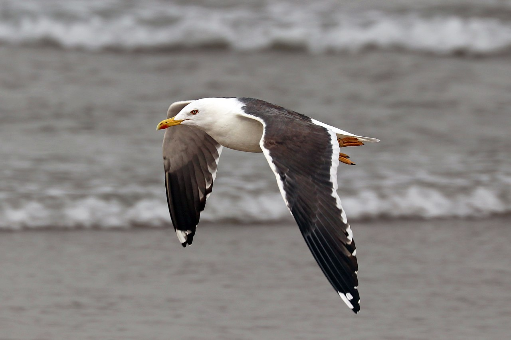
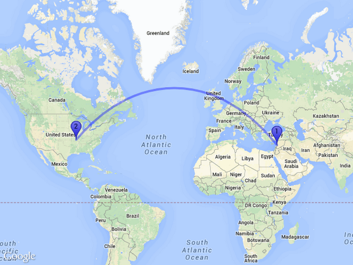

```{r setup, include=FALSE}
knitr::opts_chunk$set(echo = TRUE, fig.align = "center", warning = F, message = F)
```

<style>
body {
text-align: justify}
</style>

```{r message=FALSE}
library(tidyverse)
library(mapdeck)
library(highcharter)
library(lubridate)
library(scales)
library(ggthemes)
library(magick)
```

# Introduction

> "Animal tracking data helps us understand how individuals and populations move within local areas, migrate across oceans and continents and evolve across generations. This information is being used to address environmental challenges such as climate and land use change, biodiversity loss, invasive species, wildlife trafficking and the spread of infectious diseases."
> `r tufte::quote_footer(' Movebank')`

In this short post I want to share about how can we visualize animal tracking. The selected animal is the bird Lesser Black-backed Gull since their amazing ability to travel across the world.

```{r echo=FALSE, out.width="80%"}

```

Lesser Black-backed Gull (*Larus fuscus*) is a large gull that breeds on the Atlantic coasts of Europe. Like many migratory birds, this amazing creature can travel at very long range, from the northern hemisphere (Scandinavia and Russia) to the middle part of Africa. The bird is a social animal and often flock with other large gulls. The population is increasing overtime, with estimation population size of 110,000 pairs when breeding and 130,000 birds during wintering[^1].

# Data {.tabset .tabset-pills}

Data is acquired from *Wikelski et. al. (2015)*[^2] study on how olfactory (smell) information play crucial roles in birds migration. The dataset is divided into 3 parts:

## Reference Data

The data consists of information regarding the animal that is being tracked.

```{r message=FALSE}
df_ref <- read_csv("data/Navigation experiments in lesser black-backed gulls (data from Wikelski et al. 2015)-reference-data.csv") %>% 
    `colnames<-`(names(.) %>% str_replace_all(pattern = "[:punct:]", replacement = "_"))

glimpse(df_ref)
```

Data description:

* **tag ID** : A unique identifier for the tag, provided by the data owner.
* **animal ID** : An individual identifier for the animal, provided by the data owner. If the data owner does not provide an Animal ID, an internal Movebank animal identifier is sometimes shown.
* **animal taxon** : The scientific name of the species on which the tag was deployed, as defined by the Integrated Taxonomic Information System (ITIS, www.itis.gov).
* **deploy on date** : The date when the tag deployment started. 
* **deploy off date** : The date when the tag deployment ended. 
* **animal_death_comments** : Comments about the death of the animal.
* **animal life stage** : The age class or life stage of the animal at the beginning of the deployment. Can be years or months of age or terms such as 'adult', 'subadult' and 'juvenile'.
* **animal taxon detail** : A more specific name and/or reference for the taxon name provided by the taxon term.
* **attachment type** : The way a tag is attached to an animal.
* **deployment comments** : Additional information about the tag deployment that is not described by other reference data terms.
* **deployment end type** : A categorical classification of the tag deployment end.
* **deployment ID** : A unique identifier for the deployment of a tag on animal, provided by the data owner.
* **duty cycle** : Remarks associated with the duty cycle of a tag during the deployment, describing the times it is on/off and the frequency at which it transmits or records data.
* **location accuracy comments** : Comments about the location error estimate values provided using location error text and/or location error numerical.
* **manipulation comments** : Additional comments about the way in which the animal was manipulated during the deployment.
* **manipulation type** : The way in which the animal was manipulated during the deployment.
* **study site** : The name of the deployment site, for example a field station or colony.
* **tag manufacturer name** : The company or person that produced the tag. 
* **tag mass** : The mass of the tag.
* **tag model** : The model of the tag. 
* **tag readout method** : The way the data are received from the tag.

## GPS Data

A GPS tag calculates the location of an animal at specific time intervals using positions estimated by a network of satellites. These tags can provide high-resolution and accurate (within meters) location estimations for animals.

```{r message=FALSE}
df_gps <- read_csv("data/Navigation experiments in lesser black-backed gulls (data from Wikelski et al. 2015)-gps.csv") %>% 
  `colnames<-`(names(.) %>% str_replace_all(pattern = "[:punct:]", replacement = "_"))

glimpse(df_gps)
```

Data description:

* **event ID** : An identifier for the set of values associated with each event, i.e. sensor measurement.
* **visible** : Determines whether an event is visible on the Movebank map.
* **timestamp** : The date and time corresponding to a sensor measurement or an estimate derived from sensor measurements
* **location long** : The geographic longitude of the location as estimated by the sensor.
* **location lat** : The geographic longitude of the location as estimated by the sensor.
* **sensor type** : The type of sensor with which data were collected.
* **individual taxon canonical name** : The scientific name of the species on which the tag was deployed, as defined by the Integrated Taxonomic Information System (ITIS, www.itis.gov).
* **tag local identifier** : The scientific name of the species on which the tag was deployed, as defined by the Integrated Taxonomic Information System (ITIS, www.itis.gov).
* **individual local identifier** : An individual identifier for the animal, provided by the data owner.
* **study name**: The name of the study in Movebank. 

## Argos Data

Argos Doppler tags (known as platform transmitter terminals, or PTTs) are electronic tags that send periodic signals to Argos transmitters on polar-orbiting satellites. The location estimates are less accurate (within kilometers) than those made with a GPS, but the tags can be cheaper and lighter than GPS units and can also be used to remotely transmit GPS locations if the tag is properly equipped, and allow for location measurements from anywhere on the globe.

```{r message=FALSE}
df_argos <- read_csv("data/Navigation experiments in lesser black-backed gulls (data from Wikelski et al. 2015)-argos.csv")  %>% 
    `colnames<-`(names(.) %>% str_replace_all(pattern = "[:punct:]", replacement = "_"))

glimpse(df_argos)
```

Data description:

* **event ID** : An identifier for the set of values associated with each event, i.e. sensor measurement.
* **visible** : Determines whether an event is visible on the Movebank map.
* **timestamp** : The date and time corresponding to a sensor measurement or an estimate derived from sensor measurements
* **location long** : The geographic longitude of the location as estimated by the sensor.
* **location lat** : The geographic longitude of the location as estimated by the sensor.
* **Argos altitude** : Altitude used for location calculation, Argos DIAG format file (definition from Argos User's Manual 2011)
* **Argos best level** : Best signal strength, Argos DIAG format file (definition from Argos User's Manual 2011).
* **Argos calculated frequency** : Calculated frequency, Argos DIAG format file (definition from Argos User's Manual 2011).
* **Argos iq (quality indicator)** : This indicator gives information on the transmitter in terms of two digits, X and Y. X is the first digit and indicates residual error on the frequency calculation; Y is the second digit and indicates transmitter oscillator frequency drift between two satellite passes.
* **Argos latitude 1** : Solution 1. platform latitude in degrees and thousandths of degrees, Argos DIAG format file (definition from Argos User's Manual 2011).
* **Argos latitude 2** : Solution 2. platform latitude in degrees and thousandths of degrees, Argos DIAG format file.
* **Argos longitude 1** : Solution 1. platform longitude in degrees and thousandths of degrees, Argos DIAG format file.
* **Argos longitude 2** : Solution 2. platform longitude in degrees and thousandths of degrees, Argos DIAG format file.
* **Argos lc (location class)** : The location class retrieved from Argos.
* **Argos nb mes (Nmessages)**: The number of messages received [to calculate location], Argos DIAG format file.
* **Argos nb mes (Nmessages) 120** : The number of messages received by the satellite at a signal strength greater than -120 decibels, Argos DIAG format file.
* **Argos NOPC** : The number of plausibility checks successful (from 0-4), Argos DIAG format file.
* **Argos pass duration** : Time elapsed between the first and last message received by the satellite.
* **Argos sensor 1** : The value of the first Argos sensor
* **Argos sensor 2** : The value of the second Argos sensor
* **Argos sensor 3** : The value of the third Argos sensor
* **Argos sensor 4** : The value of the fourth Argos sensor
* **Argos valid location algorithm** : Indicates which of the two location estimates provided by Argos is the valid location, using a user-selected filter algorithm in Movebank
* **sensor type** : The type of sensor with which data were collected.
* **individual taxon canonical name** : The scientific name of the species on which the tag was deployed, as defined by the Integrated Taxonomic Information System (ITIS, www.itis.gov).
* **tag local identifier** : The scientific name of the species on which the tag was deployed, as defined by the Integrated Taxonomic Information System (ITIS, www.itis.gov).
* **individual local identifier** : An individual identifier for the animal, provided by the data owner.
* **study name**: The name of the study in Movebank. 

# Data Preprocessing

We will do some data preprocessing before making any visualization. First, we will join the reference data with the location data so that we gain full information and have more flexible analysis.

```{r}
df_join_gps <- df_gps %>% 
  left_join(df_ref, by = c("tag_local_identifier" = "tag_id", "individual_local_identifier" = "animal_id"))

df_join_argos <- df_argos %>% 
  left_join(df_ref, by = c("tag_local_identifier" = "tag_id", "individual_local_identifier" = "animal_id"))

head(df_join_gps)
```

We will calculate the distance travelled by each animal by measuring the distance between the location from one *eventid* to the next. Since we only have the information in latitude and longitude and we want to acquire the distance between two points, we can use the Haversine formula[^3].

```{r echo=FALSE, out.width="80%"}

```

The following code is the Haversine Formula. 

```{r}
convert_distance <- function(lat1, lat2, lon1, lon2){
  
  # Radius of Earth in km
  rad_earth <- 6378.137
  
  dlat <- lat2 * pi / 180 - lat1 * pi / 180
  dlon <- lon2 * pi / 180 - lon1 * pi / 180
  
  a <- (sin(dlat/2))^2 + (cos(lat1 * pi / 180))^2 * (sin(dlon/2))^2
  c <- 2 * atan2(sqrt(a), sqrt(1-a))
  d <- rad_earth * c
  
  return(d)
}
```

After we define the function to calcualte distances, now we can get the distance between event to reflect the movement of each bird.

```{r warning=FALSE}
movement_gps <- df_join_gps %>% 
  group_by(individual_local_identifier) %>% 
  arrange(timestamp) %>%
  mutate(
    start_long = location_long,
    end_long = lead(location_long),
    start_lat = location_lat,
    end_lat = lead(location_lat),
    distance = convert_distance(start_lat, end_lat, start_long, end_long)
  ) %>% 
  ungroup() %>% 
  drop_na(timestamp, end_lat, end_long) %>% 
  select(event_id, timestamp, start_long, end_long, start_lat, end_lat, distance, everything())

movement_argos <- df_join_argos %>% 
  group_by(individual_local_identifier) %>% 
  arrange(timestamp) %>%
  mutate(
    start_long = location_long,
    end_long = lead(location_long),
    start_lat = location_lat,
    end_lat = lead(location_lat),
    distance = convert_distance(start_lat, end_lat, start_long, end_long)
  ) %>% 
  ungroup() %>% 
  drop_na(timestamp, end_lat, end_long, start_long, start_lat) %>% 
  select(event_id, timestamp, start_long, end_long, start_lat, end_lat, distance, everything())

head(movement_gps, 10)
```

# Travelling Distance

First we will look at how far average *larus fuscus* travel on weekly basis. We will see the movement from the GPS data and the Argos Doppler data. We might also interested in seeing the travelling pattern between season. The seasons begin on the first day of the months that include the equinoxes and solstices: [^4]

* Spring runs from March 1 to May 31;
* Summer runs from June 1 to August 31;
* Fall (autumn) runs from September 1 to November 30; and
* Winter runs from December 1 to February 28 (February 29 in a leap year).

```{r message=FALSE}
# Distance Travel measured from GPS
time_movement_gps <- movement_gps %>% 
  mutate(
    stamp_date = date(timestamp) %>% floor_date(unit = "weeks"),
    month = month(timestamp)     
         ) %>% 
  group_by(stamp_date, individual_local_identifier, month) %>% 
  summarise(distance = sum(distance)) %>% 
  group_by(stamp_date, month) %>% 
  summarise(distance = median(distance)) %>% 
  mutate(
    log_distance = log(distance, base = 10),
    year = year(stamp_date),
    season = case_when(month %in% 3:5 ~ "Spring",
                       month %in% 6:8 ~ "Summer",
                       month %in% 9:11 ~ "Autumn",
                       TRUE ~ "Winter")
  ) %>% 
  ungroup()

# Distance Travel measured from Argos
time_movement_argos <- movement_argos %>% 
  mutate(
    stamp_date = date(timestamp) %>% floor_date(unit = "weeks"),
    month = month(timestamp)     
         ) %>% 
  group_by(stamp_date, individual_local_identifier, month) %>% 
  summarise(distance = sum(distance)) %>% 
  group_by(stamp_date, month) %>% 
  summarise(distance = median(distance)) %>% 
  mutate(
    log_distance = log(distance, base = 10),
    year = year(stamp_date),
    season = case_when(month %in% 3:5 ~ "Spring",
                       month %in% 6:8 ~ "Summer",
                       month %in% 9:11 ~ "Autumn",
                       TRUE ~ "Winter")
  ) %>% 
  ungroup()

# Joining data from GPS and Argos
time_movement <- time_movement_gps %>% 
  left_join(time_movement_argos, by = c("stamp_date","year", "season")) %>% 
  rename(gps = log_distance.x,
         argos = log_distance.y) %>% 
  select(stamp_date, gps, argos) %>% 
  pivot_longer(-stamp_date) %>% 
  drop_na(value)

# Create Northern Hemisphere Season Calendar
season_rect <- crossing(year = time_movement_gps$year, season = time_movement_gps$season) %>% 
  mutate(
    min_date = case_when(season == "Spring" ~ paste0(year, "-3-1"),
                         season == "Summer" ~ paste0(year, "-6-1"),
                         season == "Autumn" ~ paste0(year, "-9-1"),
                         TRUE ~ paste0(year, "-12-1")
                         ),
    max_date = case_when(season == "Spring" ~ paste0(year, "-5-31"),
                         season == "Summer" ~ paste0(year, "-8-31"),
                         season == "Autumn" ~ paste0(year, "-11-30"),
                         TRUE ~ paste0((year+1), "-2-28")
                         ),
    min_date = ymd(min_date),
    max_date = ymd(max_date),
    season = factor(season, levels = c("Spring", "Summer", "Autumn", "Winter"))
  ) %>% 
  arrange(min_date)

# Data Visualization
p <- time_movement %>% 
  mutate(name = ifelse(name == "gps", "GPS", "Argos")) %>% 
  ggplot() +
  geom_rect(aes(xmin = min_date, xmax = max_date, ymin = -2, ymax = 5, fill = season), 
            alpha = 0.1, data = season_rect) +
  geom_line(aes(x = stamp_date, y = value, color = name)) +
  theme_pander() +
  theme(legend.position = "top",
        legend.margin = margin(0,0,0,0),
        legend.title = element_text(colour = "dodgerblue4"),
        panel.grid.minor = element_blank()) +
  scale_fill_manual(values = c("green2", "lightyellow", "orange", "skyblue")) +
  scale_color_manual(values = c("firebrick", "dodgerblue2")) +
  scale_y_continuous(breaks = seq(-6,10,1), expand = c(0,0)) +
  scale_x_date(date_breaks = "1 year", 
               labels = date_format(format = "%Y"), 
               expand = c(0,0.05)) +
  labs(title = "Weekly Median Distance Travelled",
       color = "Sensor", fill = "Season",
       x = NULL, y = bquote("Distance in km "~(log[10]))
  )

p_magick <- image_graph(width = 1980, height = 1080, res = 300)
p
dev.off()

# Import Logo Youtube
logo <- image_read("asset/larus fuscus.png") 

# Mengatur ulang ukuran gambar
logo <-   image_scale(logo, geometry = geometry_size_percent(width = 25,height = 25))

# Letakkan gambar di posisi yang sesuai
composite_image <- image_composite(p_magick, composite_image = logo, 
                                   offset = geometry_point(x = 1750, y =  825))  

composite_image
```

The data is scaled to $log_{10}$ for easier reading. We can see that on average, the *larus fuscus* can travel for $10^2 = 100\ km$ regardless of the season. Both Argos and GPS shows little deviation from each other with some outliers present. On some occasion, the bird can travel up to 1,000 or even 10,000 km for a week. WE may need to be cautious of this data, or perhaps this can be an interesting insight and worth to inspect deeper.

# Deployment Profile

The authors deploy different manipulation technique to see the change in the migration pattern. Below is the detailed manipulation done by the authors. Most birds are not translocated at all, while some others are translocated to Heligoland (Germany) and Kazan (Russia).

```{r}
df_ref %>% 
  count(manipulation_comments, sort = T, name = "frequency") %>% 
  ggplot() +
  geom_col(aes(y = manipulation_comments %>% reorder(frequency), 
               x = frequency, fill = frequency), color = "#1D2024", show.legend = F) +
  theme_pander() +
  scale_fill_gradient(low = "firebrick4", high = "lightyellow") +
  scale_y_discrete(labels = wrap_format(width = 20)) +
  labs(title = "Type of Manipulation",
       x = "Frequency", y = NULL)
```

Some birds have ended their deployment either due to death or other reason. Below is the distribution of duration between the deployment date and the finish date, with most birds (total 19 samples) has the duration of deployment around 145 days.

```{r}
df_ref %>% 
  mutate(
    deployment_duration = deploy_off_date - deploy_on_date
  ) %>% 
  drop_na(deployment_duration) %>% 
  ggplot(aes(x = deployment_duration)) +
  geom_density(fill = "skyblue4", alpha = 0.7, color = "transparent") +
  theme_pander() +
  labs(title = "Deployment Duration (days)",
       x = NULL, y = "Density")
```

# Travel Routes {.tabset}

The travel route can be visualized based on their position on lattitude and longitude. The geospatial data are visualized using the `mapdeck` package[^5]. This package has the capability to build 3D model of global map for better visualization and aesthetic. To use mapdeck, you need to first signed up to Mapbox[^6]. You will get the key token to access the mapdeck feature.

```{r echo=FALSE}
key <- "xxxxxxxxxxxxxx"
```

## Arc Line

First we can build an Arc Line. An Arc Line is similar with the typical line but visualized in 3-dimensional way. Using this visualization, we can see the movement from one spot/event to the next one. I divided the color based on the manipulation technique deployed since its the main concern for the study. The `orange` color means that the bird is translocated to the Heligoland, Germany while the `yellow` one is translocated to Kazan, Russia. We can observe if most of the birds can go to the destination of the migration, which is the lake Victoria in this case. 

```{r }
movement_gps <- movement_gps %>% 
  mutate(
    manipulation = case_when(manipulation_comments %>% str_detect("translocated to Kazan") ~ "translocated to Kazan",
                             manipulation_comments %>% str_detect("translocated to Heligoland") ~ "translocated to Heligoland",
                             TRUE ~ manipulation_comments
                             ),
    text = paste("Animal ID :", individual_local_identifier, "<br>", 
                 "Manipulation :" ,manipulation_comments, "<br>",
                 "Distance Travelled (km) :", number(distance, big.mark = ",", accuracy = 0.1), "<br>",
                 "Date :", date(timestamp)) 
  )

mapdeck(token = key, style = mapdeck_style("satellite")) %>% 
  add_arc(
    data = movement_gps, 
    origin = c("start_long", "start_lat"),
    destination = c("end_long", "end_lat"),
    tooltip = "text", 
    palette = "plasma", 
    legend = list(stroke_from = T, stroke_to = F), 
    legend_options = list(
      stroke_from = list(title = "Type of Manipulation", style = list(title_color = "#1D2024")),
      css = "max-height: 100px;"
    ),
    auto_highlight = T,
    stroke_from = "manipulation",
    stroke_to = "manipulation",
    layer_id = 'arclayer'
      ) 
```


## Grid

Another way to visualize the distribution of the spot visited by birds is using the grid appearance, where the more dense an area/more visited an area is, the grid is being higher compared to its surrounding. We can see that the lake Victoria and some parts of Ethiopia has high density since there are many activities recorded in that area.

```{r }
mapdeck(token = key, style = mapdeck_style("dark")) %>% 
  add_grid(
    data = movement_gps,
    lat = "location_lat",
    lon = "location_long",
    legend = T, 
    auto_highlight = T,
    cell_size = 1e4,
    elevation_scale = 1e3, 
    layer_id = "grid_layer"
      )

```

## Animated Arc Line

If you want more charming visualization and get the feel of the movement from each point, you can use animated arc line where the movement from one point to another is being animated continuously. 

```{r}
mapdeck(token = key, style = mapdeck_style("satellite")) %>% 
  add_animated_arc(
    data = movement_gps, 
    origin = c("start_long", "start_lat"),
    destination = c("end_long", "end_lat"),
    tooltip = "text", 
    palette = "plasma", 
    legend = list(stroke_from = T, stroke_to = F), 
    legend_options = list(
      stroke_from = list(title = "Type of Manipulation", style = list(title_color = "#1D2024")),
      css = "max-height: 100px;"
    ),
    auto_highlight = T,
    stroke_from = "manipulation",
    stroke_to = "manipulation",
    layer_id = 'arclayer'
      ) 
```

# Reference

[^1]: [Lesser Black-backed Gull](https://www.rspb.org.uk/birds-and-wildlife/wildlife-guides/bird-a-z/lesser-black-backed-gull/)
[^2]: [Wikelski M, Arriero E, Gagliardo A, Holand R, Huttunen MJ, Juvaste R, Mueller I, Tertitski G, Thorup K, Wild M, Alanko M, Bairlein F, Cherenkov A, Cameron A, Flatz R, Hannila J, Hüppop O, Kangasniemi M, Kranstauber B, Penttinen M-L, Safi K, Semashko V, Schmid H, Wistbacka R (2015) True navigation in migrating gulls requires intact olfactory nerves. Scientific Reports 5:17061.](https://www.datarepository.movebank.org/handle/10255/move.494)
[^3]: [Haversine Formula](https://en.wikipedia.org/wiki/Haversine_formula)
[^4]: [Northern Hemisphere Season](https://www.timeanddate.com/calendar/aboutseasons.html)
[^5]: [3D Map with mapdeck package](https://github.com/SymbolixAU/mapdeck)
[^6]: [Mapping with Mapbox](https://www.mapbox.com/)
