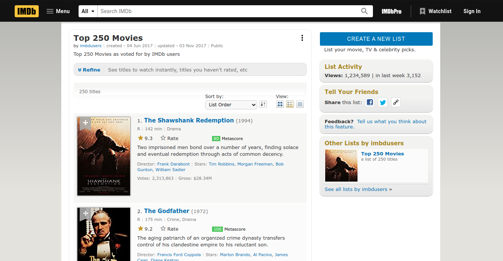

```{r setup, include=FALSE}
knitr::opts_chunk$set(echo = T, message = F, warning = F, layout="l-body-outset", eval = T)
```

<style>
  body {
  background-color: #F5F5F5;
  }
</style>

In this post, we will try to build an html table with interactive element using the `reactable` package.

# Library and Setup

Below are required packages that is needed for this post. All source code for this article can be found at my [github repository](https://github.com/Argaadya/data-visualization-series).

```{r message=FALSE}
library(rvest)
library(tidyverse)
library(lubridate)
library(reactable)
library(htmltools)
library (gtrendsR)
library(highcharter)
```

# Data Scrapping

We will scrap the information of the data from [Top 250 Movies by IMDB](https://www.imdb.com/list/ls068082370/). However, we will only take the first 100 top movies from the first page.

```{r echo=FALSE}

```

First we read the page using `rvest`. `rvest` is an effective tools to do web scraping. I have created another that will show you [how to do webscraping](https://rpubs.com/Argaadya/528626).

```{r}
url <- "https://www.imdb.com/list/ls068082370/"

webpage <- read_html(url)
```

Next, we will collect the following information from the website:

- Movie title
- Movie score
- Running time
- Genre
- Synopsis
- Actor
- Director
- Number of vote
- Release year
- Gross revenue
- Age rating

```{r}
# Movie title
movie_title <- html_nodes(webpage, ".lister-item-header a") %>% 
  html_text()

# Movie rating
movie_rating <- html_nodes(webpage, ".ipl-rating-star.small .ipl-rating-star__rating") %>% 
  html_text() %>% 
  as.numeric()

# Running time
run_time <- html_nodes(webpage, ".runtime") %>% 
  html_text() %>% 
  str_extract("[:digit:]*") %>% 
  as.numeric()

# Genre
genre <- html_nodes(webpage, ".genre") %>% 
  html_text() %>% 
  str_trim() %>% 
  str_squish()

# Synopsis
synopsis <- html_nodes(webpage, ".ipl-rating-widget+ p , .ratings-metascore+ p") %>% 
  html_text() %>% 
  str_trim() %>% 
  str_squish()

# Cast and Director
cast_dir <- html_nodes(webpage, ".ratings-metascore~ .text-small:nth-child(6) , .text-small:nth-child(5)") %>% 
  html_text() %>% 
  str_trim() %>% 
  str_squish()

director <- cast_dir %>% 
  str_extract(" .*?[|]") %>% 
  str_trim() %>% 
  str_remove(" [|]")

actor <- cast_dir %>%  
  str_extract("Stars.*") %>% 
  str_trim() %>% 
  str_remove("Stars: ")

# Number of vote
vote <- html_nodes(webpage, ".text-muted+ span:nth-child(2)") %>% 
  html_text() %>% 
  .[-c(1:3)] %>% 
  str_remove_all(",") %>% 
  as.numeric()

# Release year
year <- html_nodes(webpage, ".text-muted.unbold") %>% 
  html_text() %>% 
  str_extract("[:digit:].*") %>% 
  str_remove("\\)") %>% 
  as.numeric() %>% 
  .[-c(1:3)]

# Image
img_link <- html_nodes(webpage, "#main .loadlate") %>% 
  as.character() %>% 
  str_extract("https:.*jpg")

# Gross revenue
gross <- html_nodes(webpage, ".text-small+ .text-small") %>% 
  html_text() %>% 
  str_trim() %>% 
  str_squish() %>% 
  str_extract("\\$.*") %>% 
  str_extract("[:digit:].*") %>% 
  str_remove("M") %>% 
  as.numeric()

# Age rating
age_rate <- html_nodes(webpage, ".lister-item-header+ .text-small") %>% 
  html_text() %>% 
  str_squish() %>%
  str_remove("[|].*") %>% 
  str_remove(" min") %>% 
  str_extract("[:alpha:].*") %>% 
  str_trim()
```

# Google Trend

To add more information, we will also get the interest over time of each movie using the [google trend](https://trends.google.com/trends/?geo=world) feature with the `gtrendsR`. 

```{r eval=FALSE}
library(furrr)
plan(multisession, workers = 4)

# Done twice because of the rate limit of the API
df_trend <- future_map(movie_title[1:50], .f = function(x) gtrends(x, onlyInterest = T))
df_trend2 <- future_map(movie_title[51:100], .f = function(x) gtrends(x, onlyInterest = T))

df_trend <- df_trend %>% 
  map2(movie_title[1:50],
    function(x,y) as.data.frame(x$interest_over_time) %>% 
      mutate_all(as.character)
  ) %>% 
  bind_rows()

df_trend2 <- df_trend2 %>% 
  map2(movie_title[51:100],
    function(x,y) as.data.frame(x$interest_over_time) %>% 
      mutate_all(as.character)
  ) %>% 
  bind_rows()

# Join the data
trend_google <- df_trend %>% 
  bind_rows(df_trend2) %>% 
  mutate(date = ymd(date),
         hits = ifelse(hits == "<1", 0, hits),
         hits = as.numeric(hits),
         tooltip = paste("Number of hits:", hits)
         )

head(trend_google, 10)
```

```{r echo=FALSE}
trend_google <- read_rds("google_trend.rds")

head(trend_google, 10)
```

We can use the `highcharter` package to create the interactive plot. For example, the following is the interest over time for `The Shawshank Redemption`.

```{r}
top_movie <- trend_google %>% 
  filter(keyword == "The Shawshank Redemption") 

hchart(top_movie, "area", hcaes(x = date, y = hits)) %>% 
  hc_title(text = "") %>% 
  hc_yAxis(title = list(text = "Hits", style = list(color = "white", fontFamily = "Roboto Slab")),
           labels = list(style = list(color = "white", fontFamily = "Roboto Slab"))
           ) %>%  
  hc_xAxis(title = list(text = ""),
           labels = list(style = list(color = "white", fontFamily = "Roboto Slab"))
           )  %>% 
  hc_colors(colors = "#F56B38") %>%
  hc_size(height = 250) %>% 
  hc_tooltip(pointFormat = "{point.tooltip}")
```

We convert the plot syntax into a single function so that we can create multiple plot for each movie.

```{r}
create_plot <- function(x){
  hchart(x, "area", hcaes(x = date, y = hits)) %>% 
  hc_title(text = "") %>% 
  hc_yAxis(title = list(text = "Hits", style = list(color = "white", fontFamily = "Roboto Slab")),
           labels = list(style = list(color = "white", fontFamily = "Roboto Slab"))
           ) %>%  
  hc_xAxis(title = list(text = ""),
           labels = list(style = list(color = "white", fontFamily = "Roboto Slab"))
           )  %>% 
  hc_colors(colors = "#F56B38") %>%
  hc_size(height = 250) %>% 
  hc_tooltip(pointFormat = "{point.tooltip}")
}
```

Finally, we will prepare a nested data that will used to create plot later.

```{r}
nest_trend <- trend_google %>% 
  nest(-keyword)  

head(nest_trend)
```

# Data

Now we compile all required information into a single data.frame. I joined some column into a single column such as the movie title and the poster image link because on the final table we will display them in a single column.

```{r}
df <- data.frame(Rank = 1:100,
                 Poster = img_link,
                 Title = movie_title,
                 Synopsis = synopsis,
                 Rating = movie_rating,
                 Run_time = run_time,
                 Year = year,
                 Genre = genre,
                 Director = director,
                 Actor = actor,
                 Vote = vote,
                 Gross = gross,
                 Age_rate = age_rate
                 ) %>% 
  mutate(
    Poster_title = map2_chr(Title, Poster,  function(x,y) paste(x,y) ),
    Age_rate = ifelse(is.na(Age_rate),"", Age_rate),
    rate_vote = paste(Run_time, Vote, Gross),
    genre_time = paste(Rating, Year, Genre, Age_rate, sep = "_"),
    act_dir = paste(Director, Actor, sep = "_")
         ) %>% 
  select(Rank, Poster_title, genre_time, rate_vote, act_dir, everything()) %>% 
  left_join(nest_trend, by  = c("Title" = "keyword")) %>% 
  select(-c(Poster, Title, Rating, Actor, Director))

head(df, 10)
```

# Building Table

## Star Rating

First, we will create a function to convert movie rating into star rating.

```{r }
star_rating <- function(rating, max_rating = 10){
  
  star_icon <- function(status) {
    
    if (status == "Half") {
      tagAppendAttributes(shiny::icon("star-half-alt"),
      style = paste("color: orange"),
      "aria-hidden" = "true")
    } else {
          tagAppendAttributes(shiny::icon("star"),
      style = paste("color:", if (status == "Empty") "#edf0f2" else "orange"),
      "aria-hidden" = "true"
    )
    }
    
  }
  
  rounded_rating <- floor(rating)
  last_rating <- rating - rounded_rating
  last_rating <- case_when(last_rating < .25 ~ "Empty",
                           last_rating > .75 ~ "Full",
                           TRUE ~ "Half"
                           )
  
  stars <- lapply(seq_len(max_rating), function(i) {
    if (i <= rounded_rating) { star_icon(status = "Full")} 
    else {
      if (i == (rounded_rating+1)) star_icon(status = last_rating)
      else {
      star_icon(status = "Empty")
    }
    }
    
    })
  
  label <- sprintf("%s out of %s", rating, max_rating)
  div(title = label, "aria-label" = label, role = "img", stars)

}

# Example
star_rating(7.6)
```

## Bar Chart

Next, we create a function to create the bar chart.

```{r}
bar_chart <- function(label, width = "100%", height = "16px", fill = "#B80647", background = "#E1E1E1", icon, icon_color) {
  bar <- div(style = list(background = fill, width = width, height = height))
  chart <- div(style = list(flexGrow = 1, marginLeft = "8px", background = background), bar)
  
  icon_bar <- tagAppendAttributes(shiny::icon(icon),
      style = paste("color: ", fill),
      "aria-hidden" = "true")
  
  div(style = list(display = "flex", alignItems = "center"), icon_bar, chart)
}
```

## Basic Table

We create the ugly basic table first. For the sake of illustration, we will only use the first 10 data.

```{r}
top_10 <- df %>% 
  head(10)

reactable(top_10, 
          
          defaultPageSize = 5, # 5 data per page
          showPageSizeOptions = T, # show option to change number of data per page
          pageSizeOptions = c(5, 10, 25, 50, 100),
          highlight = T, # highlight when hover
          
          columns = list(
            # Don't show unnecessary column
            Vote = colDef(show = F),
            Gross = colDef(show = F),
            Genre = colDef(show = F),
            Year = colDef(show = F),
            Run_time = colDef(show = F),
            Age_rate = colDef(show = F)
          )
          )
```

## Table Theme

We will change the theme or the appearance of the table by specifying the theme.

```{r}
reactable(top_10, 
          
          defaultPageSize = 5, # 5 data per page
          showPageSizeOptions = T, # show option to change number of data per page
          pageSizeOptions = c(5, 10, 25, 50, 100),
          highlight = T, # highlight when hover
          
          # Table Theme
          theme = reactableTheme(backgroundColor = "#1D2024", color = "white", borderColor = "#666666",
                                 paginationStyle = list(color = "white"), 
                                 selectStyle = list(color = "black"),
                                 headerStyle = list(color = "white", fontFamily = "Arial"),
                                 cellStyle = list(color = "#FAFAFA", 
                                                    fontFamily = "Source Code Pro, Consolas, Monaco, monospace", 
                                                    fontSize = "14px")
                                 ),
          
          columns = list(
            # Don't show unnecessary column
            Vote = colDef(show = F),
            Gross = colDef(show = F),
            Genre = colDef(show = F),
            Year = colDef(show = F),
            Run_time = colDef(show = F),
            Age_rate = colDef(show = F)
          )
          )
```


## Title and Poster

Next, we convert the title and the image link into proper format.

```{r}
reactable(top_10, 
          
          defaultPageSize = 5,
          showPageSizeOptions = T, 
          pageSizeOptions = c(5, 10, 25, 50, 100),
          highlight = T, 
          
          theme = reactableTheme(backgroundColor = "#1D2024", color = "white", borderColor = "#666666",
                                 paginationStyle = list(color = "white"), 
                                 selectStyle = list(color = "black"),
                                 headerStyle = list(color = "white", fontFamily = "Arial"),
                                 cellStyle = list(color = "#FAFAFA", 
                                                    fontFamily = "Source Code Pro, Consolas, Monaco, monospace", 
                                                    fontSize = "14px")
                                 ),
          
          columns = list(
            # Don't show unnecessary column
            Vote = colDef(show = F),
            Gross = colDef(show = F),
            Genre = colDef(show = F),
            Year = colDef(show = F),
            Run_time = colDef(show = F),
            Age_rate = colDef(show = F),
            
            # Poster Title
            Poster_title = colDef(name = "Title",
                                  align = "center",
                                  minWidth = 200,
                                  cell = function(value) {
                                    image_link <- value %>% 
                                      str_extract("https:.*jpg") 
                                    
                                    # convert image link into poster
                                    image <- img(src = image_link, align = "center")
                                    
                                    text_img <- value %>% 
                                      str_remove("https.*?_tt ") %>% 
                                      str_extract(".*?https") %>% 
                                      str_remove(" https")
                                    
                                    tagList(div(strong(text_img), style = list(fontFamily = "Arial")), 
                                            br(), 
                                            image
                                            )}
                            )
          )
          )
```


## Genre and Rating

Next, we convert the second column that consists of age rating, release year, genre and star rating.

```{r}
reactable(top_10, 
          
          defaultPageSize = 5,
          showPageSizeOptions = T, 
          pageSizeOptions = c(5, 10, 25, 50, 100),
          highlight = T, 
          
          theme = reactableTheme(backgroundColor = "#1D2024", color = "white", borderColor = "#666666",
                                 paginationStyle = list(color = "white"), 
                                 selectStyle = list(color = "black"),
                                 headerStyle = list(color = "white", fontFamily = "Arial"),
                                 cellStyle = list(color = "#FAFAFA", 
                                                    fontFamily = "Source Code Pro, Consolas, Monaco, monospace", 
                                                    fontSize = "14px")
                                 ),
          
          columns = list(
            # Don't show unnecessary column
            Vote = colDef(show = F),
            Gross = colDef(show = F),
            Genre = colDef(show = F),
            Year = colDef(show = F),
            Run_time = colDef(show = F),
            Age_rate = colDef(show = F),
            
            # Poster Title
            Poster_title = colDef(name = "Title",
                                  align = "center",
                                  minWidth = 200,
                                  cell = function(value) {
                                    image_link <- value %>% 
                                      str_extract("https:.*jpg") 
                                    
                                    # convert image link into poster
                                    image <- img(src = image_link, align = "center")
                                    
                                    text_img <- value %>% 
                                      str_remove("https.*?_tt ") %>% 
                                      str_extract(".*?https") %>% 
                                      str_remove(" https")
                                    
                                    tagList(div(strong(text_img), style = list(fontFamily = "Arial")), 
                                            br(), 
                                            image
                                            )}
                            ),
            
             # Rating, Genre, Year
            genre_time = colDef(name = "   ", minWidth = 140,
                                
                                cell = function(value){
                                  
                                value_split <- str_split(value, "_") %>% 
                                   unlist() 
                                 
                                 value_star <- value_split[1] %>% as.numeric()
                                 value_year <- value_split[2] %>% as.numeric()
                                 value_genre <- value_split[3]
                                 value_rate <- value_split[4]
                                 
                                 div(h3(value_rate, 
                                        style = list(fontFamily = "Source Code Pro, Consolas, Monaco, monospace")),
                                     p(value_genre),
                                     p(paste0("Release: ", value_year)),
                                     br(),
                                     p(paste0("Rating: ", value_star)),
                                     star_rating(value_star)
                                     )
                                }
                                )
          )
          )
```

## Vote, Runtime and Gross Revenue

Now we convert the third column that consists of running time, vote, and gross revenue.

```{r}
reactable(top_10, 
          
          defaultPageSize = 5,
          showPageSizeOptions = T, 
          pageSizeOptions = c(5, 10, 25, 50, 100),
          highlight = T, 
          
          theme = reactableTheme(backgroundColor = "#1D2024", color = "white", borderColor = "#666666",
                                 paginationStyle = list(color = "white"), 
                                 selectStyle = list(color = "black"),
                                 headerStyle = list(color = "white", fontFamily = "Arial"),
                                 cellStyle = list(color = "#FAFAFA", 
                                                    fontFamily = "Source Code Pro, Consolas, Monaco, monospace", 
                                                    fontSize = "14px")
                                 ),
          
          columns = list(
            # Don't show unnecessary column
            Vote = colDef(show = F),
            Gross = colDef(show = F),
            Genre = colDef(show = F),
            Year = colDef(show = F),
            Run_time = colDef(show = F),
            Age_rate = colDef(show = F),
            
            # Poster Title
            Poster_title = colDef(name = "Title",
                                  align = "center",
                                  minWidth = 200,
                                  cell = function(value) {
                                    image_link <- value %>% 
                                      str_extract("https:.*jpg") 
                                    
                                    # convert image link into poster
                                    image <- img(src = image_link, align = "center")
                                    
                                    text_img <- value %>% 
                                      str_remove("https.*?_tt ") %>% 
                                      str_extract(".*?https") %>% 
                                      str_remove(" https")
                                    
                                    tagList(div(strong(text_img), style = list(fontFamily = "Arial")), 
                                            br(), 
                                            image
                                            )}
                            ),
            
             # Rating, Genre, Year
            genre_time = colDef(name = "   ", minWidth = 140,
                                
                                cell = function(value){
                                  
                                value_split <- str_split(value, "_") %>% 
                                   unlist() 
                                 
                                 value_star <- value_split[1] %>% as.numeric()
                                 value_year <- value_split[2] %>% as.numeric()
                                 value_genre <- value_split[3]
                                 value_rate <- value_split[4]
                                 
                                 div(h3(value_rate, 
                                        style = list(fontFamily = "Source Code Pro, Consolas, Monaco, monospace")),
                                     p(value_genre),
                                     p(paste0("Release: ", value_year)),
                                     br(),
                                     p(paste0("Rating: ", value_star)),
                                     star_rating(value_star)
                                     )
                                }
                                ),
            
            # Runtime, Vote, Gross
            # Runtime, Vote, Gross
            rate_vote = colDef(name = "  ", minWidth = 175,
                               cell = function(value){

                                 value_split <- str_split(value, " ") %>%
                                   unlist() %>%
                                   as.numeric()

                                 value_run <- value_split[1]
                                 value_vote <- value_split[2]
                                 value_gross <- value_split[3]

                                  width_vote <- paste0(value_vote / max(df$Vote) * 100, "%")
                                  value_vote <- format(value_vote, big.mark = ",")
                                  width_gross <- paste0(value_gross / max(df$Gross, na.rm = T) * 100, "%")
                                  width_run <- paste0(value_run / max(df$Run_time, na.rm = T) * 100, "%")

                                 div(br(),
                                     p(paste0("Runtime: ", value_run, " min")),
                                     bar_chart(value_run, width = width_run, icon = "clock", fill = "#2086F8"),
                                     br(),
                                     p(paste0("Vote: ", value_vote)),
                                     bar_chart(value_vote, width = width_vote, icon = "heart"),
                                     br(),
                                     p(paste0("Gross: $ ", value_gross, " M")),
                                     bar_chart(value_gross, fill = "#298241", width = width_gross, icon = "money-bill-wave")

                                     )
                               }
                               )
          )
          )
```


## Actor, Director, Synopsis

Next we transform the column for actor, director, and the movie synopsis.

```{r}
reactable(top_10, 
          
          defaultPageSize = 5,
          showPageSizeOptions = T, 
          pageSizeOptions = c(5, 10, 25, 50, 100),
          highlight = T, 
          
          theme = reactableTheme(backgroundColor = "#1D2024", color = "white", borderColor = "#666666",
                                 paginationStyle = list(color = "white"), 
                                 selectStyle = list(color = "black"),
                                 headerStyle = list(color = "white", fontFamily = "Arial"),
                                 cellStyle = list(color = "#FAFAFA", 
                                                    fontFamily = "Source Code Pro, Consolas, Monaco, monospace", 
                                                    fontSize = "14px")
                                 ),
          
          columns = list(
            # Don't show unnecessary column
            Vote = colDef(show = F),
            Gross = colDef(show = F),
            Genre = colDef(show = F),
            Year = colDef(show = F),
            Run_time = colDef(show = F),
            Age_rate = colDef(show = F),
            
            # Poster Title
            Poster_title = colDef(name = "Title",
                                  align = "center",
                                  minWidth = 200,
                                  cell = function(value) {
                                    image_link <- value %>% 
                                      str_extract("https:.*jpg") 
                                    
                                    # convert image link into poster
                                    image <- img(src = image_link, align = "center")
                                    
                                    text_img <- value %>% 
                                      str_remove("https.*?_tt ") %>% 
                                      str_extract(".*?https") %>% 
                                      str_remove(" https")
                                    
                                    tagList(div(strong(text_img), style = list(fontFamily = "Arial")), 
                                            br(), 
                                            image
                                            )}
                            ),
            
             # Rating, Genre, Year
            genre_time = colDef(name = "   ", minWidth = 140,
                                
                                cell = function(value){
                                  
                                value_split <- str_split(value, "_") %>% 
                                   unlist() 
                                 
                                 value_star <- value_split[1] %>% as.numeric()
                                 value_year <- value_split[2] %>% as.numeric()
                                 value_genre <- value_split[3]
                                 value_rate <- value_split[4]
                                 
                                 div(h3(value_rate, 
                                        style = list(fontFamily = "Source Code Pro, Consolas, Monaco, monospace")),
                                     p(value_genre),
                                     p(paste0("Release: ", value_year)),
                                     br(),
                                     p(paste0("Rating: ", value_star)),
                                     star_rating(value_star)
                                     )
                                }
                                ),
            
            # Runtime, Vote, Gross
            rate_vote = colDef(name = "  ", minWidth = 175,
                               cell = function(value){

                                 value_split <- str_split(value, " ") %>%
                                   unlist() %>%
                                   as.numeric()

                                 value_run <- value_split[1]
                                 value_vote <- value_split[2]
                                 value_gross <- value_split[3]

                                  width_vote <- paste0(value_vote / max(df$Vote) * 100, "%")
                                  value_vote <- format(value_vote, big.mark = ",")
                                  width_gross <- paste0(value_gross / max(df$Gross, na.rm = T) * 100, "%")
                                  width_run <- paste0(value_run / max(df$Run_time, na.rm = T) * 100, "%")

                                 div(br(),
                                     p(paste0("Runtime: ", value_run, " min")),
                                     bar_chart(value_run, width = width_run, icon = "clock", fill = "#2086F8"),
                                     br(),
                                     p(paste0("Vote: ", value_vote)),
                                     bar_chart(value_vote, width = width_vote, icon = "heart"),
                                     br(),
                                     p(paste0("Gross: $ ", value_gross, " M")),
                                     bar_chart(value_gross, fill = "#298241", width = width_gross, icon = "money-bill-wave")

                                     )
                               }
                               ),
            
            # Synopsis
            Synopsis = colDef(minWidth = 150,
                              align = "center",
                              cell = function(value){
                                div(style= list(color = "#FAFAFA", textAlign = "left", fontSize = "12px"), 
                                    value)
                                }
                              ),
            
            # Actor, Director
            act_dir = colDef(name = "", minWidth = 140,
                             
                             cell = function(value){
                               
                                value_split <- str_split(value, "_") %>%
                                   unlist()
                               
                                director <- value_split[1]
                                actor <- value_split[2]
                                
                                div(br(),
                                    h4("Director", style = list(fontStyle = "italic", fontFamily = "Arial")),
                                    p(director, style = list(fontSize = "12px")),
                                    h4("Actor", style = list(fontStyle = "italic", fontFamily = "Arial")),
                                    p(actor, style = list(fontSize = "12px"))
                                    )
                             }
                             )
          )
          )
```

## Finishing

Finally, we create the google trend plot for the last touch up.

```{r}
reactable(top_10, 
          
          defaultPageSize = 5,
          showPageSizeOptions = T, 
          pageSizeOptions = c(5, 10, 25, 50, 100),
          highlight = T, 
          
          theme = reactableTheme(backgroundColor = "#1D2024", color = "white", borderColor = "#666666",
                                 paginationStyle = list(color = "white"), 
                                 selectStyle = list(color = "black"),
                                 headerStyle = list(color = "white", fontFamily = "Arial"),
                                 cellStyle = list(color = "#FAFAFA", 
                                                    fontFamily = "Source Code Pro, Consolas, Monaco, monospace", 
                                                    fontSize = "14px")
                                 ),
          
          columns = list(
            # Don't show unnecessary column
            Vote = colDef(show = F),
            Gross = colDef(show = F),
            Genre = colDef(show = F),
            Year = colDef(show = F),
            Run_time = colDef(show = F),
            Age_rate = colDef(show = F),
            
            # Poster Title
            Poster_title = colDef(name = "Title",
                                  align = "center",
                                  minWidth = 200,
                                  cell = function(value) {
                                    image_link <- value %>% 
                                      str_extract("https:.*jpg") 
                                    
                                    # convert image link into poster
                                    image <- img(src = image_link, align = "center")
                                    
                                    text_img <- value %>% 
                                      str_remove("https.*?_tt ") %>% 
                                      str_extract(".*?https") %>% 
                                      str_remove(" https")
                                    
                                    tagList(div(strong(text_img), style = list(fontFamily = "Arial")), 
                                            br(), 
                                            image
                                            )}
                            ),
            
             # Rating, Genre, Year
            genre_time = colDef(name = "   ", minWidth = 140,
                                
                                cell = function(value){
                                  
                                value_split <- str_split(value, "_") %>% 
                                   unlist() 
                                 
                                 value_star <- value_split[1] %>% as.numeric()
                                 value_year <- value_split[2] %>% as.numeric()
                                 value_genre <- value_split[3]
                                 value_rate <- value_split[4]
                                 
                                 div(h3(value_rate, 
                                        style = list(fontFamily = "Source Code Pro, Consolas, Monaco, monospace")),
                                     p(value_genre),
                                     p(paste0("Release: ", value_year)),
                                     br(),
                                     p(paste0("Rating: ", value_star)),
                                     star_rating(value_star)
                                     )
                                }
                                ),
            
            # Runtime, Vote, Gross
            rate_vote = colDef(name = "  ", minWidth = 175,
                               cell = function(value){

                                 value_split <- str_split(value, " ") %>%
                                   unlist() %>%
                                   as.numeric()

                                 value_run <- value_split[1]
                                 value_vote <- value_split[2]
                                 value_gross <- value_split[3]

                                  width_vote <- paste0(value_vote / max(df$Vote) * 100, "%")
                                  value_vote <- format(value_vote, big.mark = ",")
                                  width_gross <- paste0(value_gross / max(df$Gross, na.rm = T) * 100, "%")
                                  width_run <- paste0(value_run / max(df$Run_time, na.rm = T) * 100, "%")

                                 div(br(),
                                     p(paste0("Runtime: ", value_run, " min")),
                                     bar_chart(value_run, width = width_run, icon = "clock", fill = "#2086F8"),
                                     br(),
                                     p(paste0("Vote: ", value_vote)),
                                     bar_chart(value_vote, width = width_vote, icon = "heart"),
                                     br(),
                                     p(paste0("Gross: $ ", value_gross, " M")),
                                     bar_chart(value_gross, fill = "#298241", width = width_gross, icon = "money-bill-wave")

                                     )
                               }
                               ),
            
            # Synopsis
            Synopsis = colDef(minWidth = 150,
                              align = "center",
                              cell = function(value){
                                div(style= list(color = "#FAFAFA", textAlign = "left", fontSize = "12px"), 
                                    value)
                                }
                              ),
            
            # Actor, Director
            act_dir = colDef(name = "", minWidth = 140,
                             
                             cell = function(value){
                               
                                value_split <- str_split(value, "_") %>%
                                   unlist()
                               
                                director <- value_split[1]
                                actor <- value_split[2]
                                
                                div(br(),
                                    h4("Director", style = list(fontStyle = "italic", fontFamily = "Arial")),
                                    p(director, style = list(fontSize = "12px")),
                                    h4("Actor", style = list(fontStyle = "italic", fontFamily = "Arial")),
                                    p(actor, style = list(fontSize = "12px"))
                                    )
                             }
                             ),
            
            # Inline Plot
            data = colDef(name = "Interest Over Time", 
                          minWidth = 500, align = "center",
                          cell = function(value){
                            
                            if (is.null(value) == F) {
                              create_plot(value)
                            }
                            }
                          )
          )
          )
```


